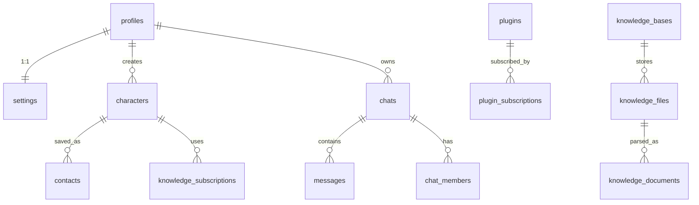

# Azusa Supabase

基于 Supabase 的 AI 角色聊天应用后端，提供用户管理、AI 角色、聊天系统、插件系统和 RAG 知识库等功能。

## 🚀 技术栈

- **Supabase** - 后端即服务 (BaaS)
  - PostgreSQL + pgvector 向量数据库
  - Supabase Auth 用户认证
  - Supabase Storage 文件存储
  - Row Level Security (RLS) 数据安全
- **Deno** - Edge Functions 运行时
- **Hono** - 高性能 Web 框架
- **LangChain** - RAG 文档处理和向量嵌入
- **Docker Compose** - 本地开发环境

## 📁 项目结构

```
azusa.supabase/
├── supabase/
│   ├── functions/          # Edge Functions
│   │   ├── main/           # 主入口路由
│   │   ├── profiles/       # 用户资料 API
│   │   ├── settings/       # 用户设置 API
│   │   ├── characters/     # AI 角色 API
│   │   ├── contacts/       # 联系人 API
│   │   ├── chats/          # 聊天 API
│   │   ├── plugins/        # 插件系统 API
│   │   ├── knowledge/      # 知识库 API (RAG)
│   │   └── _shared/        # 共享工具
│   ├── migrations/         # 数据库迁移
│   └── tests/              # 集成测试
├── volumes/                # Docker 持久化数据
├── docker-compose.yml      # 开发环境配置
└── deno.json               # Deno 配置
```

## 🛠️ 快速开始

### 前置要求

- Docker & Docker Compose
- Deno 2.x+

### 1. 克隆项目

```bash
git clone https://github.com/MTPGroup/azusa.supabase.git
cd azusa.supabase
```

### 2. 配置环境变量

复制 `.env.example` 为 `.env` 并配置：

### 3. 启动服务

```bash
# 启动所有服务
docker-compose up -d

# 查看日志
docker-compose logs -f functions
```

服务端点:
- **API Gateway**: http://localhost:8000
- **Studio (管理面板)**: http://localhost:8000
- **MinIO (文件存储)**: http://localhost:9001

### 4. 创建测试用户

在 Studio 中创建测试用户，或通过 API:
- Email: `test@example.com`
- Password: `123456`

### 5. 上传头像（示例）

```bash
curl -X POST http://localhost:8000/functions/v1/profiles/avatar \
  -H "Authorization: Bearer <user_token>" \
  -F "file=@/path/to/avatar.png"
```

- 支持 jpeg/png/webp/gif，大小 ≤ 5MB，返回公共可访问 URL。

## 🧪 测试

```bash
# 使用 Docker 环境 (默认)
TEST_ENV=docker deno test --allow-all

# 使用 Supabase CLI 环境
TEST_ENV=cli deno test --allow-all
```

## 📚 API 端点

| 模块 | 端点 | 说明 |
|------|------|------|
| Profiles | `GET/PUT /profiles` | 用户资料管理 |
| Profiles | `POST /profiles/avatar` | 上传头像（multipart，字段 `file`，5MB 内的 jpeg/png/webp/gif，返回公共 URL） |
| Settings | `GET/PATCH /settings` | 用户设置管理 |
| Characters | `CRUD /characters` | AI 角色管理 |
| Contacts | `CRUD /contacts` | 联系人管理 |
| Chats | `CRUD /chats` | 聊天会话管理 |
| Plugins | `CRUD /plugins` | 插件系统 |
| Knowledge | `CRUD /knowledge/bases` | 知识库管理 |
| Knowledge | `POST /knowledge/search` | 向量搜索 |

## 🗄️ 数据模型



## 🔐 安全

- 所有表启用 Row Level Security (RLS)
- 使用 JWT 进行 API 认证
- 数据隔离：用户只能访问自己的数据

## 📝 开发命令

```bash
# 重启 Edge Functions
docker-compose restart functions

# 生成迁移文件
supabase migration new <name>

# 运行数据库迁移
docker-compose restart migrator

# 查看数据库
docker exec supabase-db psql -U postgres -d postgres

# 生成 TypeScript 类型定义
deno task gen:types

# 清理环境
docker-compose down -v
```

## 📄 License

[MIT](LICENSE)
